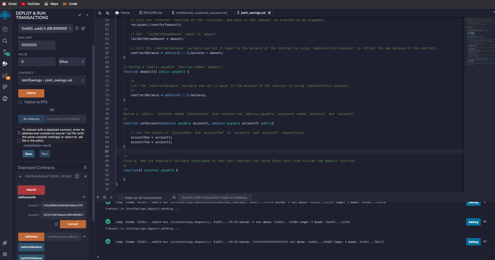
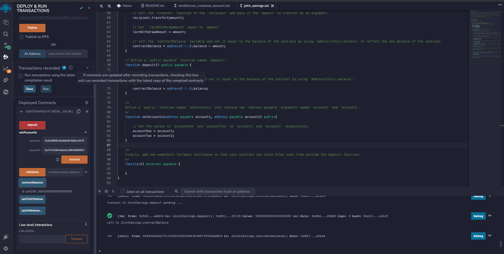

# **Challenge_20**

---

## *Smart Contracts with Solidity*

## We used solidity to create smart contracts. In this ocassion we created a joint account in which we have tested depositing and withdrawing funds in ether currency. 

## Illustration of the contract transactions 

---

> Deployment of the contract 

---

> Setting the accounts for the joint account

---

> Sending 1 Ether in wei

---

> Sending 10 Ether

---

> Sending 5 Ether

---

> Withdrawing 5 Ether

---

> Withdrawing 10 Ether

---

> Checking last used account and last amount sent/received

